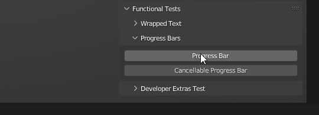

Progress Bars
=======================================================

Testing the progress bars is done manually because their implementation is quite
complex.

--------------------------------------------------------------------------------

The main criteria are the following:

* After initiating the progress bar, the original User Interface status bar is stored.

* After the disappearance of the last progress of the bar, the original method of displaying the status bar is completely restored.

* The initiated progress bar is to the right of the previous one.

* For each status bar you can change its basic parameters that affect its display (title, icon, etc.).
