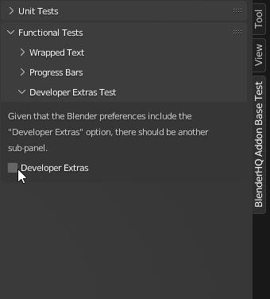

User Interface
=======================================================
Testing the user interface is quite a complex task. Of course, full automation 
of testing is possible but not feasible, as testing should be performed on all
supported versions of Blender. As this can lead to significant overhead in the
maintenance of the module itself, testing the functionality of the module in
terms of user interface utilities is done manually.

Wrapped Text Rendering
""""""""""""""""""""""""""""""""""""""""""""""""""

The main purpose of the test is that individual lines of text should not be
interrupted or shortened by the Blender User Interface.

.. image:: ../images/test_wrapped_text.gif
    :align: center

* The text block is displayed in full

* No lines ending or separated by dots

Developer Extras UI
""""""""""""""""""""""""""""""""""""""""""""""""""

* If the debug mode of the module is active, a panel with a warning about the debug mode should appear.

* The panel must contain all the options needed to disable debug mode.

Progress Bars
""""""""""""""""""""""""""""""""""""""""""""""""""

.. image:: ../images/test_progress_bars.gif
    :align: center

* After initiating the progress bar, the original User Interface status bar is stored.

* After the disappearance of the last progress of the bar, the original method of displaying the status bar is completely restored.

* The initiated progress bar is to the right of the previous one.

* For each status bar you can change its basic parameters that affect its display (title, icon, etc.).
