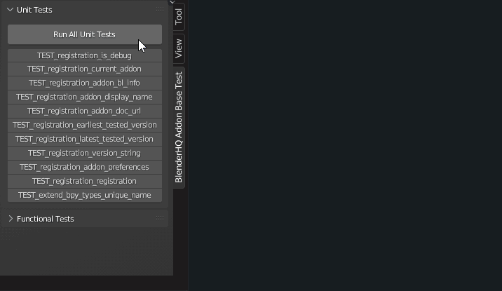

Unit Tests
=======================================================

About Unit Test System
""""""""""""""""""""""""""""""""""""""""""""""""""

Testing is also done using unit tests. With this method it is not possible to test all the functions of the module without significant overhead, so for some functionality it is still necessary to test manually using functional tests.

For unit tests, the module installed as an add-on has a set of operators that test each function separately and a main operator that runs all available unit tests.

The following is an example of how testing can be run.

Obviously, if you want to make any changes to the main repository, these changes should not destroy existing unit tests. For the new functionality - it is very desirable to write new unit tests.

Batch Unit Tests
""""""""""""""""""""""""""""""""""""""""""""""""""

There is also a system for testing the module sequentially in several versions of the Blender using the command line.

The following is an approximate method of testing:

.. image:: ../images/test_batch_unit_tests.gif
    :align: center

Actually, the module can be used as a command line utility. You can use the ``--help`` command for more detailed information on the utility options.
